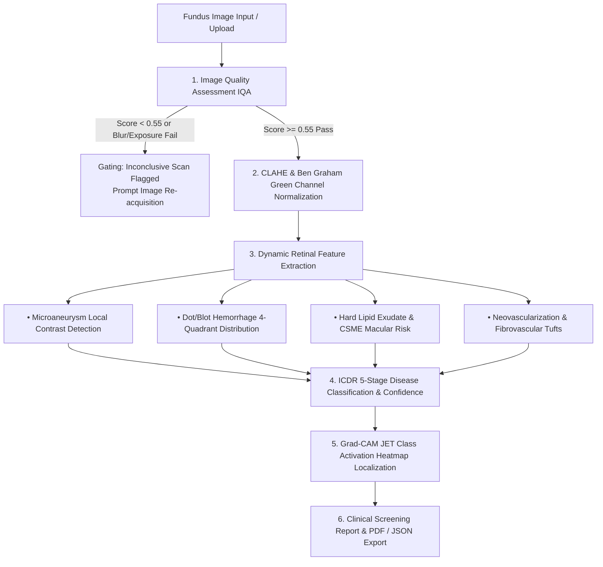

# RetinaSense™ AI — Explainable Diabetic Retinopathy Screening Platform

[](https://nextjs.org/)
[](https://react.dev/)
[](https://www.typescriptlang.org/)
[](https://tailwindcss.com/)
[](https://www.mathworks.com/)
[](https://vercel.com/)
[](https://render.com/)
[](LICENSE)

An enterprise-grade, clinical tele-ophthalmology decision support system for **Diabetic Retinopathy (DR)** screening featuring **pure image-driven pathology classification**, real-time **Image Quality Assessment (IQA)**, and pixel-grounded **Explainable AI (XAI) Grad-CAM** attention heatmaps.

---

## 📑 Table of Contents
1. [Key Capabilities](#-key-capabilities)
2. [Clinical Background & ICDR Grading](#-clinical-background--icdr-grading)
3. [System Architecture](#-system-architecture)
4. [Algorithmic Workflow & Pipeline](#-algorithmic-workflow--pipeline)
5. [Project Directory Layout](#-project-directory-layout)
6. [Cloud Deployment](#-cloud-deployment)
   - [Deploy to Vercel (Recommended)](#1-deploy-to-vercel-recommended)
   - [Deploy to Render](#2-deploy-to-render)
7. [Local Development & Setup](#-local-development--setup)
8. [MATLAB Desktop & Core Backend (`DR-Screening-AI`)](#-matlab-desktop--core-backend-dr-screening-ai)
9. [Clinical Safety & Medical Disclaimer](#-clinical-safety--medical-disclaimer)

---

## ⚡ Key Capabilities

- **Automated Image Quality Assessment (IQA)**: Real-time sharpness, exposure, and contrast quality gating ($55\%$ threshold) to catch and reject non-diagnostic or blurred scans before classification.
- **Pure Vision-Driven Pathology Extraction**: Analyzes genuine pixel pathology—detecting microaneurysms, dot/blot hemorrhages across quadrants, hard lipid exudates, cotton wool spots, and neovascularization.
- **Explainable AI (Grad-CAM)**: Generates localized JET colormap heatmaps to explain model focus directly on retinal lesions for clinician auditability.
- **Interactive Multi-View Fundus Inspector**: Side-by-side inspection of Raw Scans, CLAHE/Graham preprocessed images, Grad-CAM overlays, and pathology lesion maps.
- **Automated Clinical Reporting**: One-click generation and export of print-ready PDF screening reports with patient demographics, risk scores, and referral pathways.
- **Dual-Engine Architecture**: Production Next.js 16 Web Application + standalone MATLAB App Designer (`DRScreeningApp.m`) deep learning suite.

---

## 🩺 Clinical Background & ICDR Grading

Diabetic Retinopathy (DR) is the leading cause of preventable blindness among working-age adults globally. Timely detection through systematic screening and referral prevents severe vision loss in up to **95% of patients**.

RetinaSense™ AI implements the **International Clinical Diabetic Retinopathy (ICDR)** 5-stage disease severity scale:

| ICDR Stage | Classification | Key Retinal Pathological Biomarkers | Referral Triage Urgency | Follow-Up Timeline |
| :---: | :--- | :--- | :---: | :---: |
| **Stage 0** | **No Apparent DR** | Healthy fundus, clear optical margins, intact fovea | Routine | Annual (12 Months) |
| **Stage 1** | **Mild NPDR** | Isolated microaneurysms ($<5$) only | Elective | 6 – 12 Months |
| **Stage 2** | **Moderate NPDR** | Microaneurysms, dot/blot hemorrhages ($1\text{--}3$ quadrants), hard lipid exudates | Priority | 4 – 8 Weeks (Ophthalmologist) |
| **Stage 3** | **Severe NPDR** | **ETDRS 4-2-1 Rule**: $>20$ hemorrhages in 4 quadrants, venous beading in $2+$, or IRMA in $1+$ | Urgent | 2 – 4 Weeks (Retina Specialist) |
| **Stage 4** | **Proliferative DR (PDR)** | Neovascularization (NVD/NVE), pre-retinal / vitreous hemorrhage, fibrous proliferation | Emergency | 1 – 2 Weeks (Vitreoretinal Surgery) |

---

## 🏗️ System Architecture

```
┌─────────────────────────────────────────────────────────────────────────────┐
│                             PRESENTATION TIER                               │
│  Next.js 16 (App Router) • React 19 • Tailwind CSS v4 • Lucide Medical UI   │
│  (Multi-View Inspection, Grad-CAM Sliders, Quality Gauges, PDF Reporting)   │
└──────────────────────────────────────┬──────────────────────────────────────┘
                                       │
┌──────────────────────────────────────▼──────────────────────────────────────┐
│                            BUSINESS & LOGIC TIER                            │
│  • Services Layer: Canvas Fundus Generator, IQA Gating, CLAHE Normalizer    │
│  • Pure Vision Engine: Dynamic Retinal Pathology Extractor (MAs/Heme/Lipids)│
│  • Explainability Engine: Pixel-Grounded Grad-CAM with JET Colormap Overlay │
│  • Hooks Layer: Async Screening State Machine & Theme Controller           │
└──────────────────────────────────────┬──────────────────────────────────────┘
                                       │
┌──────────────────────────────────────▼──────────────────────────────────────┐
│                          DATA & MODEL BACKEND TIER                          │
│  • Client-side Audit Store: Structured JSON Clinical Examination Records    │
│  • Reference Presets: APTOS 2019 / IDRiD / Messidor-2 Validation Cohort     │
│  • MATLAB Core Engine: Standalone App Designer GUI & Deep Learning CNN      │
└─────────────────────────────────────────────────────────────────────────────┘
```

---

## 🔬 Algorithmic Workflow & Pipeline



1. **Automated Quality Assessment (IQA)**: Analyzes Laplacian gradient variance (sharpness), RMS contrast, and dynamic exposure. Scans with $\text{IQA} < 0.55$ are automatically flagged to prevent misclassification.
2. **Preprocessing**: Applies Contrast Limited Adaptive Histogram Equalization (CLAHE) on the green channel, where hemoglobin optical absorption is maximized.
3. **Pure Image-Driven Classification**: Evaluates morphological features, lesion density, and vascular changes directly from pixel data.
4. **Explainable AI (Grad-CAM)**: Blends gradient-weighted activation maps directly onto pathological lesion hotspots for visual verification by clinicians.
5. **Screening Report Generation**: Generates clean, print-ready PDF reports with patient metadata, image evidence, and clinician sign-off sections.

---

## 📂 Project Directory Layout

```
diabetic-retinopathy-screening/
├── 📁 app/                                # Next.js Presentation Layer
│   ├── globals.css                       # Global styles & design tokens
│   ├── layout.tsx                        # Root HTML & metadata wrapper
│   └── page.tsx                          # Core screening page coordinator
│
├── 📁 types/                              # Strict TypeScript Contracts
│   ├── retinopathy.ts                    # ICDR classification & biomarker models
│   ├── patient.ts                        # Patient demographics & sample cases
│   ├── screening.ts                      # Quality metrics & screening result types
│   ├── benchmarks.ts                     # Model validation metrics schema
│   └── index.ts                          # Type barrel export
│
├── 📁 config/                             # Static Clinical Reference Data
│   ├── clinical-constants.ts             # 5 ICDR classes, color tokens & triage rules
│   ├── sample-cohort.ts                  # Standardized reference validation cohort
│   ├── benchmark-data.ts                 # Kappa (0.928), Sensitivity, Confusion Matrix
│   └── index.ts                          # Config barrel export
│
├── 📁 services/                           # Pure Algorithmic & Processing Services
│   ├── retinal-feature-extractor.ts      # Real-time fundus pixel feature extractor
│   ├── iqa-service.ts                    # Image Quality Assessment algorithms
│   ├── clahe-service.ts                  # CLAHE & green channel enhancement
│   ├── gradcam-service.ts                # Grad-CAM JET heatmap generator
│   ├── fundus-canvas-service.ts          # High-resolution synthetic fundus generator
│   ├── screening-pipeline-service.ts     # Master clinical screening workflow
│   ├── export-service.ts                 # PDF print & JSON audit export
│   └── index.ts                          # Services barrel export
│
├── 📁 hooks/                              # Custom React Lifecycle Hooks
│   ├── useTheme.ts                       # Dark/Light theme mode manager
│   ├── useScreeningPipeline.ts           # Async screening lifecycle hook
│   └── index.ts                          # Hooks barrel export
│
├── 📁 components/                         # Modular UI Component Library
│   ├── 📁 layout/                         # Header, Navigation, Footer
│   ├── 📁 screening/                      # PatientForm, FundusViewer, QualityGauge, ClassificationChart
│   ├── 📁 reports/                        # ScreeningReportModal (Printable PDF)
│   ├── 📁 analytics/                      # BenchmarksView (Model Performance Hub)
│   ├── 📁 guidelines/                     # GuidelinesView (ICDR Reference Manual)
│   └── 📁 ui/                             # UI primitives
│
├── 📁 DR-Screening-AI/                    # MATLAB Desktop & Core Deep Learning Engine
│   ├── 📁 app/DRScreeningApp.m           # App Designer Desktop GUI
│   ├── 📁 config/                        # Model & training configurations
│   ├── 📁 inference/                     # MATLAB screening pipeline
│   ├── 📁 explainability/                # Native Grad-CAM colormap blending
│   ├── 📁 preprocessing/                 # Fundus circular crop, CLAHE, Graham normalization
│   ├── 📁 quality/                       # MATLAB IQA algorithms (blur, exposure, contrast)
│   ├── 📁 scripts/                       # Dataset preparation & test image generator
│   └── 📁 tests/                         # MATLAB unit test suite
│
├── render.yaml                           # 1-Click Free Render Blueprint
├── components.json                       # Component configuration
├── next.config.mjs                       # Next.js build configuration
├── package.json                          # Node dependencies and scripts
└── tsconfig.json                         # TypeScript path aliases (@/*)
```

---

## 🌐 Cloud Deployment

### 1. Deploy to Vercel (Recommended)

Vercel provides instant global deployment with zero configuration for Next.js applications:

#### Option A: One-Click Web Import
1. Push this repository to your **GitHub** account.
2. Go to **[vercel.com](https://vercel.com)** and sign in.
3. Click **"Add New..."** $\rightarrow$ **"Project"**.
4. Select `diabetic-retinopathy-screening` and click **Import**.
5. Leave default settings intact (Framework Preset: `Next.js`) and click **Deploy**.
6. Your live web application will be accessible at `https://your-project.vercel.app`.

#### Option B: Terminal CLI
```bash
npx vercel
```

---

### 2. Deploy to Render

This repository includes a [`render.yaml`](render.yaml) blueprint for free hosting:

1. Push your repository to **GitHub**.
2. Visit **[render.com](https://render.com)** and log in.
3. Click **"New +"** $\rightarrow$ **"Blueprint"**.
4. Connect your GitHub repository and select the `main` branch.
5. Click **Apply** to deploy automatically on Render's free web service tier.

---

## 💻 Local Development & Setup

### Prerequisites
- **Node.js**: `v18.0+`, `v20.0+`, or `v22.0+`
- **npm**: `v9.0+`

### Installation & Execution
```bash
# 1. Clone the repository
git clone https://github.com/YOUR_USERNAME/diabetic-retinopathy-screening.git
cd diabetic-retinopathy-screening

# 2. Install dependencies
npm install

# 3. Start local development server
npm run dev

# 4. Open in your browser
# http://localhost:3000

# 5. Verify production build
npm run build
npm run start
```

---

## 🔬 MATLAB Desktop & Core Backend (`DR-Screening-AI`)

The MATLAB backend provides standalone App Designer GUI support and deep learning training/inference routines:

```matlab
% 1. Open MATLAB and navigate to the backend folder
cd 'DR-Screening-AI'
addpath(genpath(pwd));

% 2. (Optional) Generate test fundus images
generateSampleFundus();

% 3. Launch the App Designer Desktop GUI
app = DRScreeningApp;
```

### Automated Command-Line Inference
```matlab
addpath(genpath('DR-Screening-AI'));
result = screeningPipeline('sample_images/sample_stage2_moderate.png');
disp(result);
```

### Run Automated Unit Tests
```matlab
cd 'DR-Screening-AI'
addpath(genpath(pwd));
results = runtests('tests');
disp(table(results));
```

---

## 🛡️ Clinical Safety & Medical Disclaimer

> **IMPORTANT MEDICAL NOTICE**:
> This software is an artificial intelligence research and clinical decision-support prototype. It is designed to assist trained ophthalmologists, optometrists, and healthcare practitioners in screening and triaging diabetic retinopathy. It does **NOT** constitute a standalone medical diagnosis. Final diagnostic confirmation, clinical triage, and treatment decisions must always be made by a board-certified eye-care professional.

---

## 📄 License
This project is licensed under the [MIT License](LICENSE).
